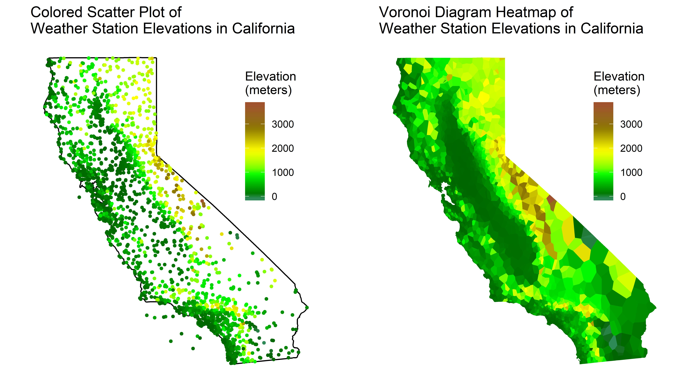

# Summary

Spatial data are often gathered at the individual point level, structured as a set of coordinates coupled with a set of measurements. However, attempts to visualize point-level data usually fall into two categories: a scatter plot or some spatial binning technique such as a raster or choropleth diagram of data aggregates. The Voronoi diagram, a mathematical tool that partitions a plane into localized regions around observed points, can be used to create an alternative method for point-level data visualization. A Voronoi diagram is a nearest neighbor diagram: given a set of generator points, the Voronoi diagram creates nearest neighbor cells. Each cell is formed around one generator point, and the set of points closest to that generator is fully contained in its cell. The resulting diagram can be used to find the nearest generator for an arbitrary point or to interpolate the blank space around each generator to create a heatmap.

Voronoi diagrams have a multitude of applications, but ``ggvoronoi`` implements toold for data visualization and spatial data analysis in ``R``. For data visualization, ``ggvoronoi`` fits nicely within the ``ggplot2`` framework, so ``R`` users experienced with the popular visualization package can create Voronoi diagrams and heatmaps around any point-level dataset within minutes. For spatial data analysis, ``R`` users can create a Voronoi diagram within the ``sp`` framework as a ``SpatialPolygonsDataFrame`` object. From there, the user can find the nearest generator point to each location in a new ``SpatialPoints`` object or use tools, such as those contained in``rgeos``, to analyze the diagram.

``ggvoronoi`` depends on ``R`` [@R] as well as a number of ``R`` packages. First, the algorithm from ``deldir`` [@deldir] is used to construct Voronoi cells. The raw output is manipulated with functions from ``sp`` [@sp; @spbook], ``rgeos`` [@rgeos], and ``raster`` [@raster] to create spatial objects. Finally, the ``ggplot2`` [@ggplot2] framework is used to visualize the results. The package was built to be used by statisticians and data scientists for spatial data analysis as well as statistics students as a tool to approach data visualization with point-level data. The package is in use in a number of ongoing projects such as extending National Weather Service forecasts to National Climatic Data Center weather stations and interpolating predictions from a Land Use Random Forest model to all of Greater Cincinnati. At Miami University, ``ggvoronoi`` has been used in the Advanced Data Visualization course as a demonstration of how to visualize point-level spatial data with ``ggplot2``. Furthermore, ``ggvoronoi`` was recently utilized to visually explore the location of train stations in Japan [@rblog]. 

# Acknowledgements

``ggvoronoi`` was inspired by work done at Miami University’s annual DataFest. We acknowledge the Center for Analytics and Data Science and the Statistics Department at Miami University for supporting the development of the package and for hosting DataFest with the American Statistical Association. 

# References

